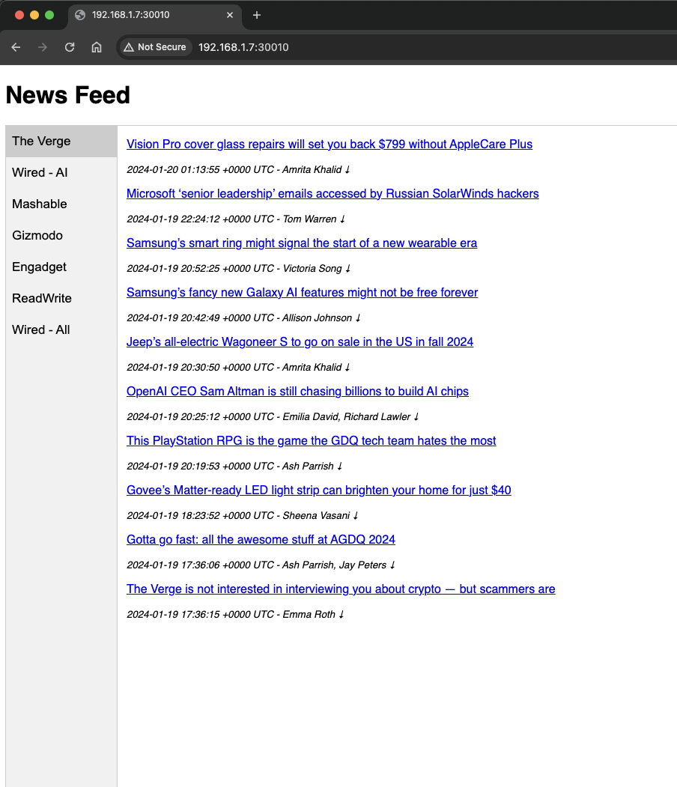
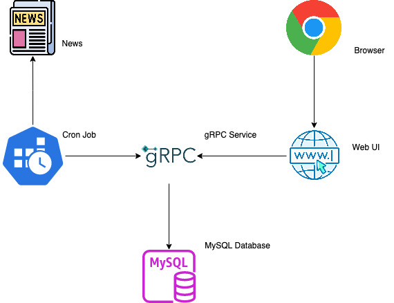

# feed
News crawler

## Description

Feed is a news crawler.  The crawler downloads content from several RSS websites such as The Verge, Wired, Mashable, etc.  The crawler is triggered by CronJob, which makes gRPC call to store the content into MySQL database.  A very simple web UI displays the latest aggregated news feed.  The CronJob, Web UI and gRPC are containerized and its workload is managed in Kubernetes.  

The infrastructure components such as Kubernetes and MySQL are hosted in my homelab, with the exception of Docker hub.

## Infrastructure

### Kubernetes homelab

I use [kubeadm](https://kubernetes.io/docs/reference/setup-tools/kubeadm/) to setup a Kubernetest cluster with master node and two worker nodes.

```
kubectl top nodes
NAME                    CPU(cores)   CPU%   MEMORY(bytes)   MEMORY%
k8smaster.edison.net    339m         2%     20483Mi         64%
k8sworker1.edison.net   153m         3%     3840Mi          54%
k8sworker2.edison.net   178m         2%     10143Mi         31%

kubectl get nodes
NAME                    STATUS   ROLES           AGE    VERSION
k8smaster.edison.net    Ready    control-plane   251d   v1.27.1
k8sworker1.edison.net   Ready    <none>          251d   v1.27.1
k8sworker2.edison.net   Ready    <none>          251d   v1.27.1
```

### Cronjob

The Cronjob crawls the news feed.  It invokes gRPC to get the list of websites, then it downloads and stores the content  
by invoking gRPC.  The process runs concurrently.  It is containerized and managed in Kubernetes.   
Link to [source code](https://github.com/elumbantoruan/feed/tree/main/cmd/cronjob).

```
kubectl get cronjobs
NAME               SCHEDULE      SUSPEND   ACTIVE   LAST SCHEDULE   AGE
newsfeed-cronjob   */5 * * * *   False     0        3m44s           6h41m
```

### gRPC

The gRPC provides a data service operation for MySQL.  It is containerized and managed in Kubernetes.  
Link to [source code](https://github.com/elumbantoruan/feed/tree/main/cmd/grpc/server).
```
kubectl get services newsfeed-grpc
NAME            TYPE       CLUSTER-IP      EXTERNAL-IP   PORT(S)          AGE
newsfeed-grpc   NodePort   10.102.73.165   <none>        9000:30008/TCP   13h
```

### Web UI

The web UI displays the most recent news feed. It invokes gRPC to get data.  It is containerized and managed in Kubernetes.  
Link to [source code](https://github.com/elumbantoruan/feed/tree/main/cmd/web).
```
kubectl get services newsfeed-web
NAME           TYPE       CLUSTER-IP     EXTERNAL-IP   PORT(S)          AGE
newsfeed-web   NodePort   10.101.3.164   <none>        5000:30010/TCP   35h
```



### pods
```
kubectl get pods
NAME                              READY   STATUS      RESTARTS   AGE
newsfeed-cronjob-28421320-7jkvk   0/1     Completed   0          11m
newsfeed-cronjob-28421325-n6r2r   0/1     Completed   0          6m25s
newsfeed-cronjob-28421330-89zjh   0/1     Completed   0          85s
newsfeed-grpc-5fd97bfb69-ns7ln    1/1     Running     0          18h
newsfeed-grpc-5fd97bfb69-qsn5r    1/1     Running     0          18h
newsfeed-web-6b665875cc-4mwhk     1/1     Running     0          41h
newsfeed-web-6b665875cc-lxl4m     1/1     Running     0          41h
```

### MySQL

At this point, MySQL database is not managed in Kubernetes, rather as a local installation.  
Link to [database schema](https://github.com/elumbantoruan/feed/tree/main/pkg/storage/db-script).

### Docker hub
Link to [docker hub](https://hub.docker.com/repositories/edisonlt) for CronJob, Web UI and gRPC repositories.

## Components Diagram

