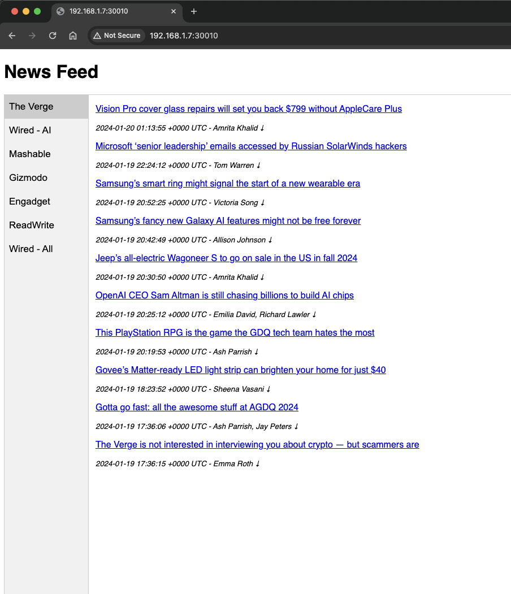
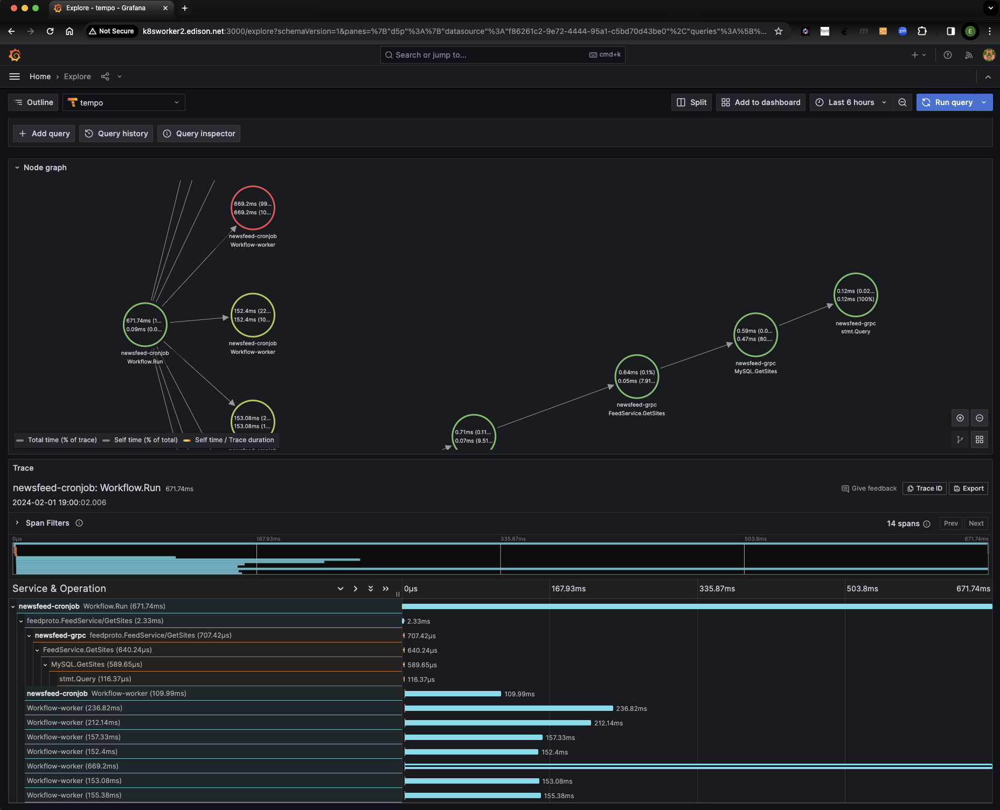
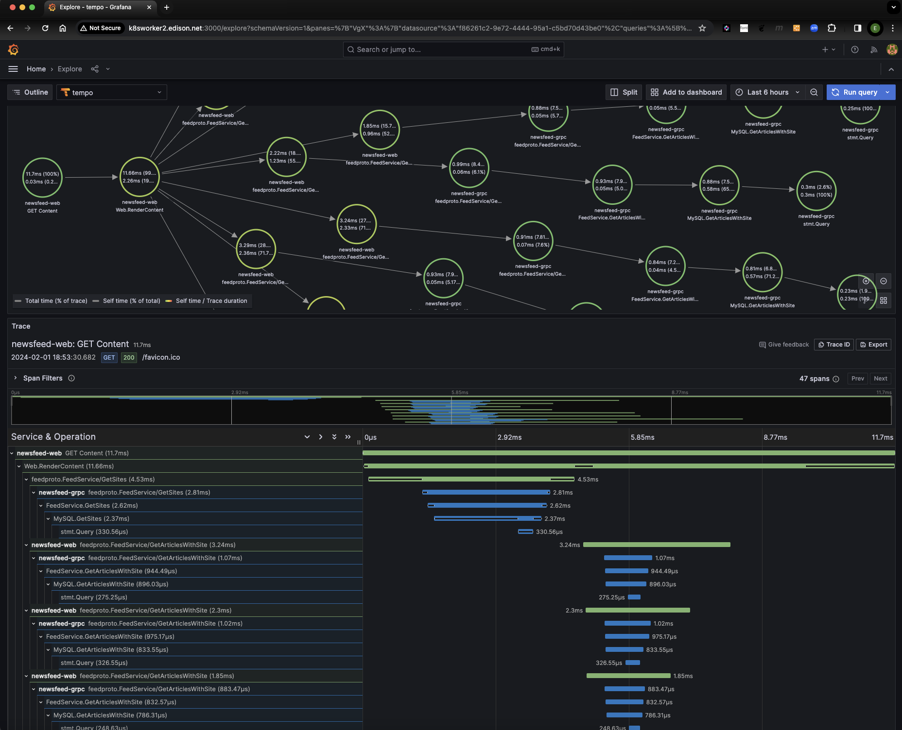
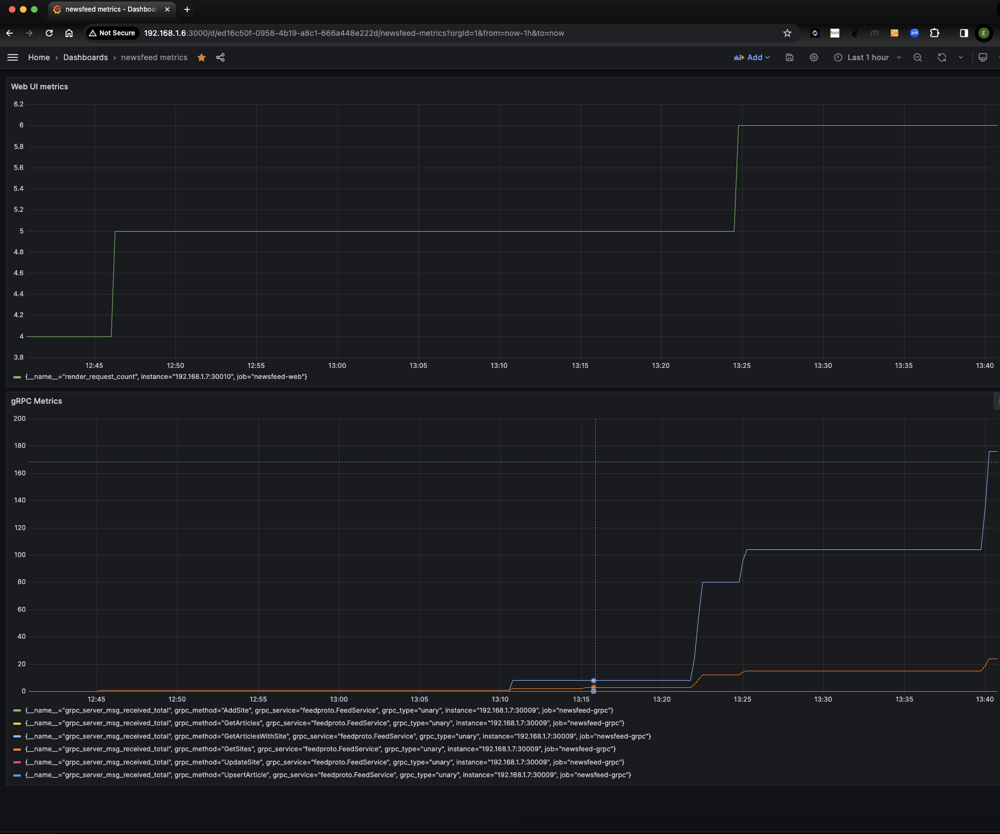
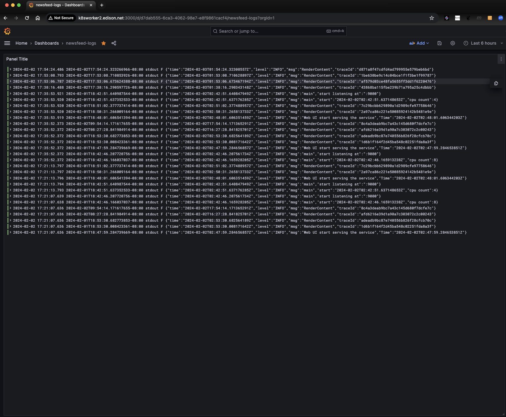
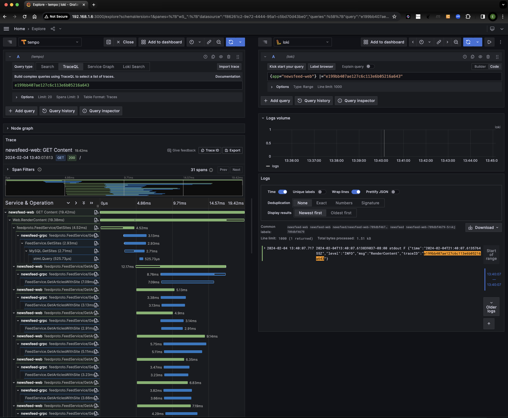
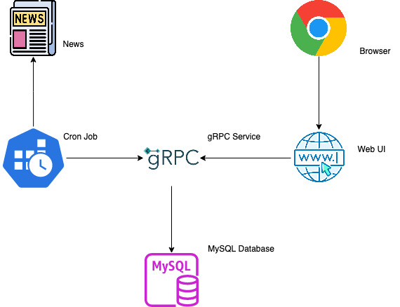

# feed

News crawler

## Description

Feed is a news crawler.  The crawler downloads content from several RSS websites such as The Verge, Wired, Mashable, etc.  The crawler is triggered by CronJob, which makes gRPC call to store the content into MySQL database.  A very simple web UI displays the latest aggregated news feed.  The CronJob, Web UI and gRPC are containerized and its workload is managed in Kubernetes.  
Telemetry is implemented using Open Telemetry with Grafana Tempo as Telemetry Provider.

The infrastructure components such as Kubernetes, Grafana and MySQL are hosted in my homelab, with the exception of Docker hub.

## Infrastructure

### Kubernetes

I use [kubeadm](https://kubernetes.io/docs/reference/setup-tools/kubeadm/) to setup a Kubernetest cluster with master node and two worker nodes at my homelab.

``` text
kubectl top nodes
NAME                    CPU(cores)   CPU%   MEMORY(bytes)   MEMORY%
k8smaster.edison.net    339m         2%     20483Mi         64%
k8sworker1.edison.net   153m         3%     3840Mi          54%
k8sworker2.edison.net   178m         2%     10143Mi         31%

kubectl get nodes
NAME                    STATUS   ROLES           AGE    VERSION
k8smaster.edison.net    Ready    control-plane   251d   v1.27.1
k8sworker1.edison.net   Ready    <none>          251d   v1.27.1
k8sworker2.edison.net   Ready    <none>          251d   v1.27.1
```

#### Cronjob

``` text
kubectl get cronjobs
NAME               SCHEDULE      SUSPEND   ACTIVE   LAST SCHEDULE   AGE
newsfeed-cronjob   */5 * * * *   False     0        3m44s           6h41m
```

#### gRPC

``` text
kubectl get services newsfeed-grpc
NAME            TYPE       CLUSTER-IP      EXTERNAL-IP   PORT(S)          AGE
newsfeed-grpc   NodePort   10.102.73.165   <none>        9000:30008/TCP   13h
```

#### Web UI

``` text
kubectl get services newsfeed-web
NAME           TYPE       CLUSTER-IP     EXTERNAL-IP   PORT(S)          AGE
newsfeed-web   NodePort   10.101.3.164   <none>        5000:30010/TCP   35h
```

#### pods

``` text
kubectl get pods -o wide
NAME                              READY   STATUS      RESTARTS   AGE     IP               NODE                    NOMINATED NODE   READINESS GATES
newsfeed-cronjob-28454355-whzgm   0/1     Completed   0          33m     172.16.234.30    k8sworker2.edison.net   <none>           <none>
newsfeed-cronjob-28454370-ktfjs   0/1     Completed   0          18m     172.16.234.41    k8sworker2.edison.net   <none>           <none>
newsfeed-cronjob-28454385-h2nsm   0/1     Completed   0          3m16s   172.16.234.42    k8sworker2.edison.net   <none>           <none>
newsfeed-grpc-7484d4ffcb-djfrc    1/1     Running     0          35m     172.16.234.38    k8sworker2.edison.net   <none>           <none>
newsfeed-grpc-7484d4ffcb-hvpc4    1/1     Running     0          35m     172.16.103.233   k8sworker1.edison.net   <none>           <none>
newsfeed-web-789dbf4679-qw4xn     1/1     Running     0          44m     172.16.234.32    k8sworker2.edison.net   <none>           <none>
newsfeed-web-789dbf4679-xz7ht     1/1     Running     0          44m     172.16.103.232   k8sworker1.edison.net   <none>           <none>
promtail-daemonset-jszbn          1/1     Running     0          3d22h   172.16.103.200   k8sworker1.edison.net   <none>           <none>
promtail-daemonset-rcq2d          1/1     Running     0          3d22h   172.16.234.14    k8sworker2.edison.net   <none>           <none>
```

### MySQL

At this point, MySQL database is not managed in Kubernetes, rather as a local installation.  
Link to [database schema](https://github.com/elumbantoruan/feed/tree/main/pkg/storage/db-script).

### Docker hub

Link to [docker hub](https://hub.docker.com/repositories/edisonlt) for CronJob, Web UI and gRPC repositories.

## Services

### Cronjob service  

The Cronjob crawls the news feed to download the content.  It invokes gRPC to get the list of websites and stores the content.  
The process runs concurrently.  It is containerized and managed in Kubernetes.  
Link to [source code](https://github.com/elumbantoruan/feed/tree/main/cmd/cronjob).

### gRPC service  

The gRPC provides a data service operation for MySQL.  It is containerized and managed in Kubernetes.  
Link to [source code](https://github.com/elumbantoruan/feed/tree/main/cmd/grpc/server).

### Web UI service  

The web UI displays the most recent news feed for all sites. It invokes gRPC to get data concurrently.  It is containerized and managed in Kubernetes.  
Link to [source code](https://github.com/elumbantoruan/feed/tree/main/cmd/web).



## Observability

### Traces

#### Cronjob --> gRPC

The following is the trace from Cronjob which creates multiple Workflow worker to download the content concurrently.  
The span started from Cronjob (newsfeed-cronjob) traverses to gRPC (newsfeed-grpc) to get the list of feed sites (GetSites) and it's ended with the child span represents MySQL


#### WebUI --> gRPC

The following is the trace from WebUI to render the list of feed sites along with the content for each feed site.  
The span started from WebUI (newsfeed-web) traversed to gRPC (newsfeed-grpc) to get the list of feed sites (GetSites), and the content of each feed site (GetArticlesWithSite) and it's ended with the child span represents MySQL.



#### Service Graph

Below is the service map that represent the relational and dependency of the entire systems including Cronjob, Web UI, gRPC, and MySQL.  
Moreover, Grafana Tempo also generate metrics from ingested traces using [metrics-generator](https://grafana.com/docs/tempo/latest/getting-started/metrics-from-traces/#:~:text=Tempo%20can%20generate%20metrics%20from,service%20graphs%20and%20span%20metrics).


### Metrics

The following is the metrics captured by Prometheus for WebUI request and gRPC calls.



### Logs

The following are the logs stored in Grafana Loki.  Traces and logs can be linked together by traceID




## Components Diagram

Below is the components diagram, where Cronjob and WebUI utilize gRPC as a data service to store and get data from MySQL


